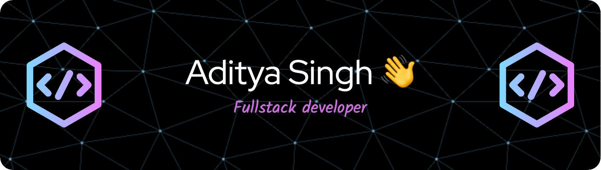

  
  
  ### Software Engineer from India | Building the Future, One Line at a Time
  
  

### 🚀 About Me
- 🎓 B.Tech in Computer Science from IIIT Kottayam
- 🌱 Currently exploring **VueJs**
- 💡 Always eager to learn new technologies
- ⚡ Fun fact: I bring humor to coding sessions! 😄

### 🏆 Achievements
- Ranked in **Top 10%** on LeetCode
- Global Rank **278** in CodeChef July Long Challenge
- **300+ days** of consistent problem solving on LeetCode
- Solved **800+** Problems on LeetCode (Rating: 1685)
- Global Rank **1483** out of 22,000+ candidates in LeetCode Weekly Contest 343

---

### 🛠️ Languages and Tools 

---

### 📊 GitHub Stats

  
  
  
  
  

### 🔗 Connect With Me

---

  <i>Happy Coding! 👨‍💻</i>

